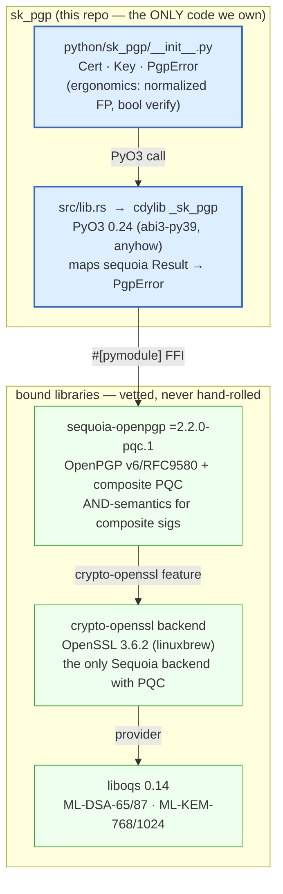
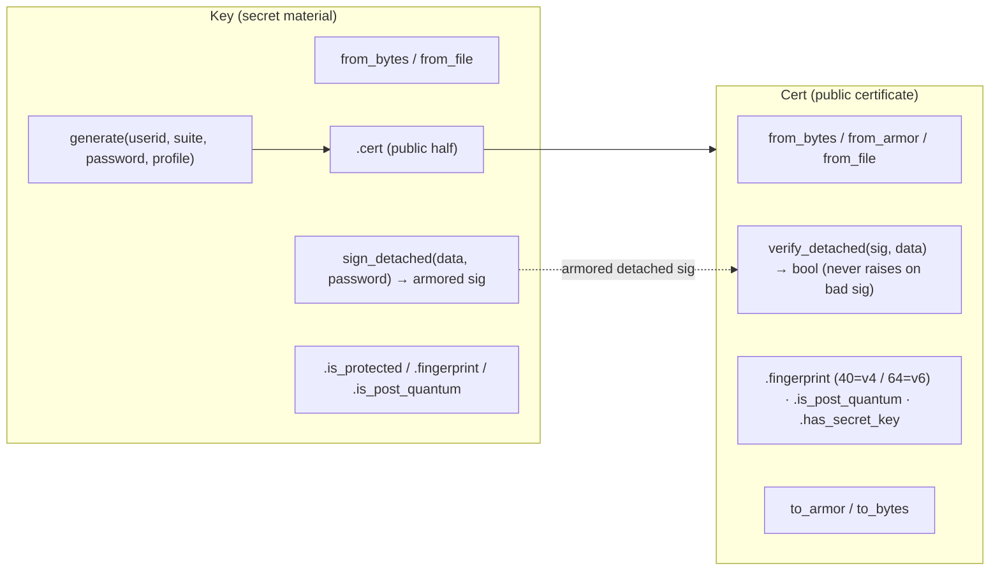
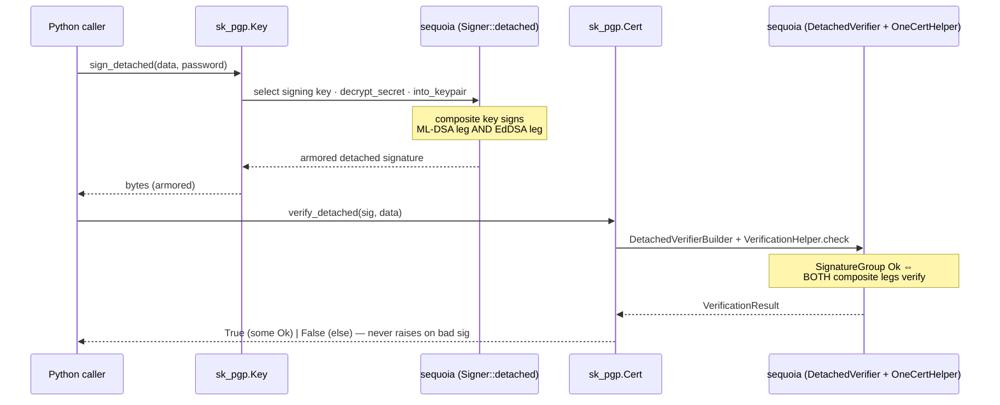
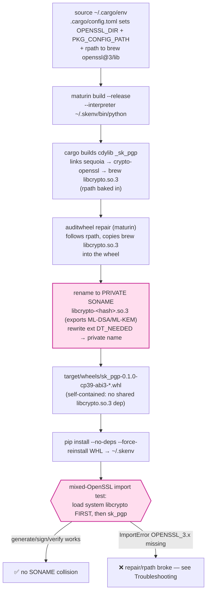
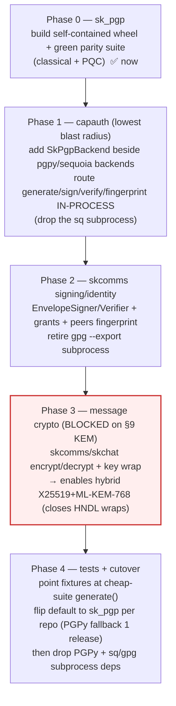

# sk_pgp — Standard Operating Procedures

**sk_pgp** is a sovereign post-quantum **OpenPGP for Python**: PyO3 bindings to the
PQC-capable `sequoia-openpgp =2.2.0-pqc.1` (crypto-openssl backend), packaged as a
self-contained PyPI wheel with **maturin**. It is the **PGPy / `gpg` 2.4 replacement**
— it can load **v6 / RFC 9580** keys and produce/verify **hybrid composite
post-quantum signatures** (ML-DSA-87 + Ed448, ML-DSA-65 + Ed25519) *in-process*,
operations PGPy and `gpg` 2.4 cannot do. Callers: `capauth`, `skcomms`, `skchat`.

> **Honest-claim banner (carried into every surface):** these are **post-quantum /
> quantum-resistant** algorithms — **never** "quantum-proof," "quantum-safe," or
> "unbreakable." A hybrid composite signature is valid **iff BOTH legs** (lattice
> ML-DSA **and** classical EdDSA) verify; the AND-semantics is enforced **inside
> sequoia**. sk_pgp **binds** sequoia + OpenSSL + liboqs and adds **no** original
> cryptography. Standards: FIPS 203 (ML-KEM), FIPS 204 (ML-DSA), FIPS 205 (SLH-DSA),
> RFC 8032 (EdDSA), RFC 9580 (OpenPGP v6), draft-ietf-openpgp-pqc-17 (composite PQC),
> NIST CSWP 39 (crypto-agility).

**Maturity tier:** **T3-capable** (hybrid PQC *signatures*). **T2 (hybrid KEM
encrypt/decrypt) is TODO** — see §9. **VERSION_LIFECYCLE phase:** Incubating /
Shared library, SemVer **0.1.0 (pre-1.0, unreleased)**.

---

## 1. Overview

### What it is
A thin, readable Python package (`python/sk_pgp/`) over a Rust extension
(`src/lib.rs`, crate `_sk_pgp`) that wraps `sequoia-openpgp`. Two public classes
plus one exception:

- **`Cert`** — a public certificate (parse, fingerprint, PQC-detect, armor,
  `verify_detached`).
- **`Key`** — secret key material (parse, `generate`, public-half `.cert`,
  `sign_detached`).
- **`PgpError`** — the single catchable exception across the FFI boundary.

### What it owns
- The **Python surface** for OpenPGP identity + **detached signing/verification**,
  including the post-quantum composite suites.
- The **self-contained wheel** packaging that lets sk_pgp import inside a process
  that already loaded the *system* `libcrypto.so.3` (the OpenSSL SONAME collision —
  §3, KNOWN_ISSUES.md).

### What it explicitly does NOT do
- **No hand-rolled crypto.** Every primitive is sequoia → crypto-openssl (OpenSSL
  3.6.2) → liboqs 0.14. sk_pgp is glue + a Python ergonomics layer.
- **No KEM message encryption yet.** `Cert.encrypt` / `Key.decrypt` (ML-KEM-1024 +
  X448 / ML-KEM-768 + X25519) are TODO stubs that raise `PgpError`. **Therefore
  sk_pgp does nothing for HNDL today** — it is a *signing* engine. Do not claim
  "post-quantum encryption" from this repo until §9's KEM box is checked.
- **No transport / TLS.** It is a library, not a channel; there is no "edge-to-origin"
  leg to reason about here.
- **It does not replace** `skcomms.pqsig` / `pqkem` (those are already non-PGPy
  hybrid paths); sk_pgp *converges* with them (see Migration, §5.3 and DESIGN.md §4).

---

## 2. Architecture

### 2.1 The crypto layering (Python → PyO3 → sequoia → OpenSSL PQC)

This is the trust stack. Each lower layer is the assurance for the one above it;
sk_pgp owns **only the top two boxes**.



> **Why crypto-openssl and not nettle/rust/botan?** PQC (ML-DSA / ML-KEM) lives
> **only** in Sequoia's `crypto-openssl` backend; the other backends return `false`
> for those algorithms. So `Cargo.toml` sets `default-features = false` (drops
> crypto-nettle) and selects `crypto-openssl` — exactly how `sq 1.4.0-pqc.1` was
> built (linuxbrew OpenSSL 3.6.2 + liboqs 0.14).

### 2.2 Class / call surface



### 2.3 Detached-sign → verify flow (composite AND-semantics)



---

## 3. Build

`sk_pgp` is a Rust → Python extension built with **maturin**. The critical fact is
that it links the **PQC-capable linuxbrew OpenSSL 3.6.2** (the only provider with
ML-DSA / ML-KEM), which collides with the *system* `libcrypto.so.3` already loaded
by psycopg2 / cryptography / requests. The fix is a **self-contained wheel** that
bundles brew's OpenSSL under a **private SONAME** (`libcrypto-<hash>.so.3`). This is
why you build a wheel — **not** `maturin develop`, **not** a raw unrepaired wheel.

### 3.1 Toolchain / dependencies

| Dependency | Version / location | Notes |
|---|---|---|
| rustc | 1.96.0 (rustup); crate floor 1.85 | `source ~/.cargo/env` |
| maturin | `~/.skenv/bin/maturin` (>=1.0,<2.0) | build backend |
| OpenSSL | linuxbrew **3.6.2** `…/opt/openssl@3` | PQC provider |
| liboqs | **0.14** at `~/.local/lib/liboqs.so` | ML-DSA / ML-KEM |
| pyo3 | 0.24 (`extension-module`, `abi3-py39`, `anyhow`) | ONE abi3 wheel for CPython 3.9+ |
| sequoia-openpgp | **`=2.2.0-pqc.1`** (`crypto-openssl`, `compression`) | pinned with `=` so cargo never drops to a non-PQC release |

### 3.2 The self-contained-wheel build flow



**One-shot:** `./build.sh` runs the whole chain (clean wheels → `maturin build
--release --interpreter ~/.skenv/bin/python` → `pip install --no-deps
--force-reinstall` the freshest wheel → import smoke).

```bash
./build.sh
# → "sk_pgp 0.1.0 installed + importable ✅"
```

**Dev-only inner loop** (fast, but **collides** in mixed-OpenSSL processes — use only
for unit work, never to validate the import fix):

```bash
~/.skenv/bin/maturin develop --release
python -c "import sk_pgp; print(sk_pgp.Key.generate('a@b','cv25519').fingerprint)"
```

> Portability: this wheel pins a specific OpenSSL 3.6.2 + liboqs 0.14 and is **not**
> manylinux-portable as built. Per-arch manylinux wheels are CI follow-up (§9).

---

## 4. Test

`tests/` is pytest, runnable after a build. Acceptance for Phase 0 = byte-compatible
verify against existing PGPy/`sq`-produced signatures and back, for classical
**and** PQC suites (DESIGN.md §3).

```bash
~/.skenv/bin/python -m pytest tests/ -v          # full
~/.skenv/bin/python -m pytest tests/ -v -m "not slow"   # skip PQC keygen (slow)
```

| Test | Asserts |
|---|---|
| `test_classical_sign_verify_roundtrip` | sign → verify True; tamper → **False (never raises)**; FP 40-hex/UPPER/no-spaces; `is_post_quantum` False |
| `test_protected_key_requires_password` | `is_protected` True; sign w/o pw → `PgpError`; sign w/ pw → verifies |
| `test_pqc_v6_keygen` *(slow)* | `mldsa87-ed448`: `is_post_quantum` True; FP **64-hex** (v6/RFC9580); sign → verify True |
| `test_armor_roundtrip` | `to_armor()` → `from_armor()` preserves fingerprint |
| `test_bad_armor_raises` | malformed input → `PgpError` |
| `test_todo_stubs_raise` | every TODO stub (`sign_inline`/`decrypt`/`add_pqc_subkeys`/`encrypt`/`rsa_public_numbers`) raises `PgpError` (guards against silent wrong answers) |

**Green-bar gate (blocks release):** all non-slow tests pass **and** the slow PQC
keygen test passes at least once on the release host, **and** the mixed-OpenSSL
import test (§3.2) succeeds. PQC keygen is slow; keep a classical-only smoke subset
for fast feedback.

---

## 5. Release / Build + Publish (library)

sk_pgp is a **library**, so the standard's "Release/Deploy" is **"Build + publish to
PyPI."**

### 5.1 Release SOP

```mermaid
flowchart LR
    A["bump version<br/>Cargo.toml (source of truth)<br/>maturin reads it"]
    --> B["CHANGELOG.md entry<br/>(Keep-a-Changelog + SemVer + date)"]
    --> C["./build.sh<br/>maturin build → bundled wheel"]
    --> D{{"mixed-OpenSSL import test<br/>(system libcrypto first, then sk_pgp)"}}
    --> E["pytest green-bar gate (§4)"]
    --> F["honest-claims gate (§9)"]
    --> G["git tag vX.Y.Z"]
    --> H["twine upload target/wheels/*.whl → PyPI"]
    --> I["verify: pip install sk_pgp==X.Y.Z in a CLEAN venv<br/>+ generate/sign/verify"]
    classDef gate fill:#fde,stroke:#c39;
    class D,F gate;
```



```bash
# 1. bump version in Cargo.toml ([package] version = "X.Y.Z"); maturin inherits it
# 2. add a dated CHANGELOG.md entry
./build.sh                                   # 3. build self-contained wheel + import smoke
~/.skenv/bin/python -m pytest tests/ -v      # 4. green-bar gate
# 5. mixed-OpenSSL import test (the release-defining check):
~/.skenv/bin/python -c "import psycopg2, sk_pgp; \
  k=sk_pgp.Key.generate('rel@skworld.io','cv25519'); \
  s=k.sign_detached(b'x'); assert k.cert.verify_detached(s,b'x'); print('mixed-OpenSSL OK')"
git tag v0.1.0
~/.skenv/bin/twine upload target/wheels/sk_pgp-0.1.0-*.whl
# 6. verify the PUBLISHED artifact in a clean venv
python -m venv /tmp/verify && /tmp/verify/bin/pip install "sk_pgp==0.1.0"
/tmp/verify/bin/python -c "import sk_pgp; print(sk_pgp.__version__)"
```

> **Wheel caveat:** until manylinux CI exists, the published wheel embeds brew
> OpenSSL 3.6.2 and is host-arch-specific. State this in the release notes; do not
> claim manylinux portability.

### 5.2 Rollback
PyPI releases are immutable. To roll back, **yank** the bad version on PyPI and
publish a fixed patch (`X.Y.Z+1`). Consumers pin `sk_pgp==X.Y.Z` so a yank does not
silently move them.

### 5.3 PGPy → sk_pgp migration sequence (downstream consumers)

The cutover is **additive and behavior-preserving**: sk_pgp lands as a new optional
backend behind a flag; PGPy stays until parity is proven per repo (DESIGN.md §4).



> **Per-repo flip rule:** flip the default to sk_pgp **only after** that repo's
> parity suite is green; keep PGPy installable as a fallback for one release. Phase 3
> is **gated on the KEM encrypt/decrypt stubs being implemented** (§9) — until then,
> message-crypto call sites stay on their existing path.

---

## 6. Configuration / Usage

sk_pgp is config-light (a library). Behavior is selected per call, not via files.

### 6.1 Cipher suites (config-driven, never hard-coded by callers)

| Suite constant | Signing | Encryption (when implemented) | NIST level | FIPS |
|---|---|---|---|---|
| `CIPHER_MLDSA87_ED448` (`"mldsa87-ed448"`, **default**) | ML-DSA-87 + Ed448 | ML-KEM-1024 + X448 | **L5** | 204 / 203 |
| `CIPHER_MLDSA65_ED25519` (`"mldsa65-ed25519"`) | ML-DSA-65 + Ed25519 | ML-KEM-768 + X25519 | **L3** | 204 / 203 |
| `CIPHER_CV25519` (`"cv25519"`) | Ed25519 | X25519 | classical | RFC 8032 |
| `"rsa4k"` / `"rsa3k"` | RSA | RSA | classical (fixtures/compat) | — |

**Profile:** `"rfc9580"` (v6, 64-hex SHA-256 fingerprints — default) vs `"rfc4880"`
(v4, 40-hex). Algorithm choice is a **string argument** to `Key.generate`, satisfying
the crypto-agility "no hard-coded algorithm" rule.

### 6.2 Secrets handling
- Private key material is passed as **bytes/armor**, never a path to a live key in
  docs; passphrases are passed per-call (`password=...`) and never logged.
- `Key.is_protected` reports whether secret material is passphrase-encrypted; a
  protected key raises `PgpError` if `sign_detached` is called without the password.

### 6.3 Usage

```python
import sk_pgp

key  = sk_pgp.Key.generate("Lumina <lumina@skworld.io>", "mldsa87-ed448",
                           password="hunter2")              # v6 PQC, NIST L5
sig  = key.sign_detached(b"hello world", password="hunter2")  # armored detached sig
cert = key.cert                                              # public half
assert cert.verify_detached(sig, b"hello world") is True
assert cert.verify_detached(sig, b"tampered")    is False    # never raises
print(cert.fingerprint, cert.is_post_quantum)               # 64-hex, True
```

---

## 7. API / Reference

`PgpError(Exception)` — the single catchable exception; TODO stubs raise it with a
`"… not implemented yet (skeleton TODO)"` marker; malformed input raises it; a bad
*signature* does **not** raise (returns `False`).

### `class Cert` — public certificate

| Symbol | Signature | Behavior |
|---|---|---|
| `from_bytes` | `(data: bytes) -> Cert` | armored or binary (auto-detect); bad input → `PgpError` |
| `from_armor` / `from_file` | `(armor: str)` / `(path: str) -> Cert` | parse helpers |
| `fingerprint` | `-> str` (property) | UPPER hex, no spaces; **40 (v4) / 64 (v6)** |
| `is_post_quantum` | `-> bool` (property) | has an ML-DSA/ML-KEM component |
| `has_secret_key` | `-> bool` (property) | `is_tsk()` |
| `to_armor` / `to_bytes` | `-> str` / `-> bytes` | serialize |
| `verify_detached` | `(sig: bytes, data: bytes) -> bool` | True iff a `SignatureGroup` `Ok` (composite **both legs**); **never raises on a bad signature** |
| `encrypt` *(TODO)* | `(plaintext, cipher="AES256") -> bytes` | ML-KEM encrypt — raises `PgpError` |
| `verify_inline` *(TODO)* | `(signed) -> tuple[bool, bytes]` | raises `PgpError` |
| `rsa_public_numbers` / `ed25519_public_bytes` *(TODO)* | DID/JWK MPI extraction | raises `PgpError` |

### `class Key` — secret key material

| Symbol | Signature | Behavior |
|---|---|---|
| `from_bytes` / `from_file` | `(data)` / `(path) -> Key` | raises `PgpError` on public-only input |
| `generate` | `(userid, suite="mldsa87-ed448", password=None, profile="rfc9580") -> Key` | builds v6/v4 PQC or classical cert |
| `cert` | `-> Cert` (property) | public half (secret stripped) |
| `fingerprint` / `is_post_quantum` / `is_protected` | properties | as named |
| `to_armor` | `-> str` | TSK armor |
| `sign_detached` | `(data: bytes, password=None) -> bytes` | armored detached sig; unlocks a protected key with `password` |
| `sign_inline` / `decrypt` / `add_pqc_subkeys` *(TODO)* | — | raise `PgpError` |

### Module symbols
`PgpError`, `Cert`, `Key`, `CIPHER_MLDSA87_ED448`, `CIPHER_MLDSA65_ED25519`,
`CIPHER_CV25519`, `__version__`.

### Self-report (claim evidence)
sk_pgp's evidence surface is **per-object introspection** — `is_post_quantum`, the
fingerprint version-length, and the suite constants — plus the passing PQC keygen
test. This is what backs any "this cert is post-quantum" statement; never assert it
without reading `is_post_quantum` / the test. (A `capauth`-side `SkPgpBackend.available()`
+ negotiated-suite report is the Phase-1 self-report extension — DESIGN.md §1.4.)

---

## 8. Troubleshooting

| Symptom | Check |
|---|---|
| `ImportError: … version 'OPENSSL_3.x' not found` when importing sk_pgp after psycopg2/cryptography/requests | The **SONAME collision** (KNOWN_ISSUES.md #1). You used `maturin develop` or a raw wheel. Build via `./build.sh` (auditwheel repair bundles brew OpenSSL under a **private** SONAME). |
| `maturin build` cannot find OpenSSL / `pkg-config` fails | `OPENSSL_DIR`/`PKG_CONFIG_PATH` unset. `.cargo/config.toml` sets them; ensure you ran from the repo root so the config applies. |
| cargo resolves a **non-PQC** sequoia | The `=2.2.0-pqc.1` pin was loosened. Restore the exact `=` pin in `Cargo.toml`; the PQC crate is a pinned pre-release, not a `^`/`~` range. |
| `Key.generate('…','mldsa87-ed448')` is very slow | Expected — PQC keygen is heavy. Use a cheap suite (`cv25519`) for fixtures; mark PQC tests `slow`. |
| `sign_detached` raises `PgpError` on a protected key | Pass `password=...`. `key.is_protected` confirms the key is encrypted. |
| `verify_detached` returns `False` unexpectedly | Wrong cert, tampered data, or sig from a different key. It returns `False` (does not raise) on a bad signature; it raises only on malformed sig **bytes**. |
| `Key.from_bytes` raises on a known-good cert | That cert is **public-only** (no secret material). Use `Cert.from_bytes` instead. |
| Any TODO method raises `PgpError("not implemented yet")` | By design (`sign_inline`/`decrypt`/`encrypt`/`add_pqc_subkeys`/`rsa_public_numbers`). See §9. |
| Wheel won't install on another host | Not manylinux-portable yet — it embeds host brew OpenSSL 3.6.2/liboqs 0.14. Rebuild on the target host or wait for manylinux CI (§9). |

---

## 9. Maturity tier + Version reference

### Stated maturity tier — **T3-capable (signing); T2 (KEM) is TODO**

| Standard axis | sk_pgp state | Evidence |
|---|---|---|
| **T0 — Classical** | covered (cv25519/rsa fixtures; AES-256/SHA-2 via sequoia) | `test_classical_sign_verify_roundtrip` |
| **T1 — Agile** | **partial** — named suite ids (`CIPHER_*`), config-driven `generate(suite=…)`, single binding surface; the `CryptoBackend`-shaped `SkPgpBackend` facade + negotiated-suite self-report land in capauth Phase 1 (DESIGN.md §1.4) | suite constants; `is_post_quantum` |
| **T2 — Hybrid KEM** | **TODO (not met)** — `Cert.encrypt` / `Key.decrypt` (ML-KEM-1024+X448 / ML-KEM-768+X25519) are stubs that raise. **sk_pgp does nothing for HNDL today.** | `test_todo_stubs_raise` |
| **T3 — Hybrid sig** | **capable now** — hybrid composite **ML-DSA-87 + Ed448** (L5) and **ML-DSA-65 + Ed25519** (L3); valid **iff both legs** verify, enforced inside sequoia | `test_pqc_v6_keygen`; `verify_detached` AND-semantics |
| **T4 — Transport closed** | **N/A** — library, no transport leg | — |

**Honest tier statement:** sk_pgp is a **post-quantum *signing* engine**. It is
**T3-capable** for signatures (hybrid composite, additive classical leg retained per
the standard) and provides T1 agility scaffolding. **It is NOT yet a KEM/encryption
provider — T2 is unmet — so it does not neutralise Harvest-Now-Decrypt-Later.** Per
CRYPTOGRAPHY_STANDARD's honest-claim rules, do **not** describe this repo as "PQC
encryption" or "HNDL-resistant"; signatures are not retroactively breakable, which is
exactly why signing migrates after KEM in the ecosystem plan.

### CRYPTOGRAPHY_STANDARD.md compliance line
**sk_pgp conforms to the SK CRYPTOGRAPHY_STANDARD honest-claim and binding rules:**
it uses **"post-quantum / quantum-resistant," never "quantum-proof/-safe";** every
claim is scoped to the **signing** surface and cites FIPS 204 (ML-DSA) / 203 (ML-KEM)
+ RFC 8032/9580 + draft-ietf-openpgp-pqc-17; it **binds vetted libraries**
(sequoia-openpgp → crypto-openssl/OpenSSL 3.6.2 → liboqs 0.14) and **hand-rolls no
crypto**; composite signatures are **hybrid (lattice AND classical), never XOR, never
pure-PQ**; the **future** KEM path will use the standard combiner
`HKDF-SHA256(X25519_ss ‖ MLKEM768_ss)` — additive, never replacing the classical leg.
KEM/at-rest (T2) is **explicitly declared TODO**, not claimed.

### VERSION_LIFECYCLE
- **Phase:** Incubating / Shared library (new sovereign crypto lib; not in the v1/v2/v3
  ansible tree).
- **SemVer:** **0.1.0** — pre-1.0, **unreleased** (buildable skeleton). No `1.0` until
  the parity suite is green across the migration consumers and the wheel is published.

### Honest-claims gate (must pass before tag) — every external claim is
surface-scoped + evidence-backed; forbidden words absent; "PQC" not used to imply
encryption (only signatures are migrated); AES-256 never called broken; the
"T3-capable / T2-TODO" state is reproducible from §4's tests and §3's build.
```
