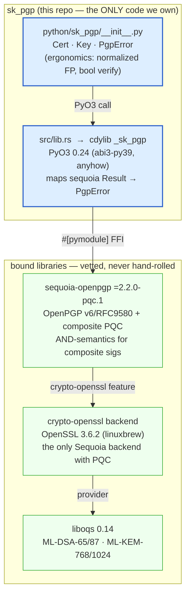
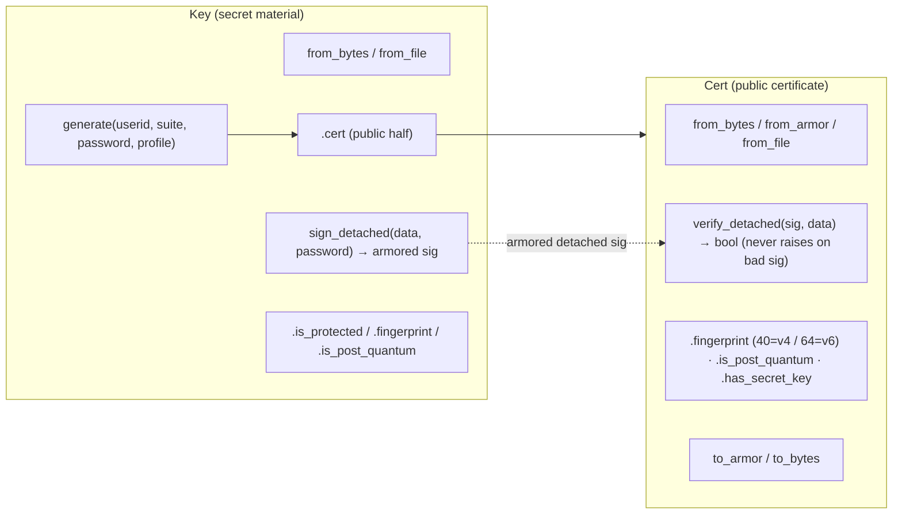
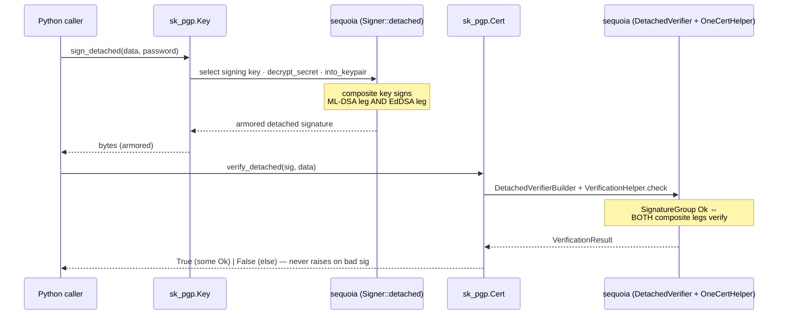
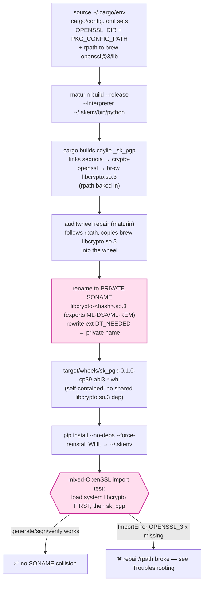
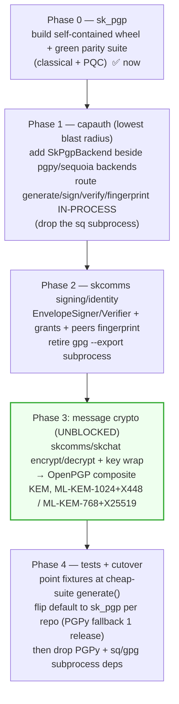

# sk_pgp — Standard Operating Procedures

**sk_pgp** is a sovereign post-quantum **OpenPGP for Python**: PyO3 bindings to the
PQC-capable `sequoia-openpgp =2.2.0-pqc.1` (crypto-openssl backend), packaged as a
self-contained PyPI wheel with **maturin**. It is the **PGPy / `gpg` 2.4 replacement**
— it can load **v6 / RFC 9580** keys and produce/verify **hybrid composite
post-quantum signatures** (ML-DSA-87 + Ed448, ML-DSA-65 + Ed25519) *in-process*,
operations PGPy and `gpg` 2.4 cannot do. Callers: `capauth`, `skcomms`, `skchat`.

> **Honest-claim banner (carried into every surface):** these are **post-quantum /
> quantum-resistant** algorithms — **never** "quantum-proof," "quantum-safe," or
> "unbreakable." A hybrid composite signature is valid **iff BOTH legs** (lattice
> ML-DSA **and** classical EdDSA) verify; the AND-semantics is enforced **inside
> sequoia**. sk_pgp **binds** sequoia + OpenSSL + liboqs and adds **no** original
> cryptography. Standards: FIPS 203 (ML-KEM), FIPS 204 (ML-DSA), FIPS 205 (SLH-DSA),
> RFC 8032 (EdDSA), RFC 9580 (OpenPGP v6), draft-ietf-openpgp-pqc-17 (composite PQC),
> NIST CSWP 39 (crypto-agility).

**Maturity tier:** **T3** (hybrid PQC *signatures*) **and T2** (hybrid KEM
encrypt/decrypt, via the OpenPGP composite KEM). See §9 for the per-axis evidence.
**VERSION_LIFECYCLE phase:** Incubating / Shared library, SemVer **0.1.0 (pre-1.0,
unreleased)**. Version source of truth: `[package] version` in `Cargo.toml`, which
maturin reads.

---

## 1. Overview

### What it is
A thin, readable Python package (`python/sk_pgp/`) over a Rust extension
(`src/lib.rs`, crate `_sk_pgp`) that wraps `sequoia-openpgp`. Two public classes
plus one exception:

- **`Cert`** — a public certificate (parse, fingerprint, PQC-detect, armor,
  `verify_detached`).
- **`Key`** — secret key material (parse, `generate`, public-half `.cert`,
  `sign_detached`).
- **`PgpError`** — the single catchable exception across the FFI boundary.

### What it owns
- The **Python surface** for OpenPGP identity + **detached signing/verification**,
  including the post-quantum composite suites.
- The **self-contained wheel** packaging that lets sk_pgp import inside a process
  that already loaded the *system* `libcrypto.so.3` (the OpenSSL SONAME collision —
  §3, KNOWN_ISSUES.md).

### What it explicitly does NOT do
- **No hand-rolled crypto.** Every primitive is sequoia → crypto-openssl (OpenSSL
  3.6.2) → liboqs 0.14. sk_pgp is glue + a Python ergonomics layer.
- **No key-agreement protocol, no session management.** `Cert.encrypt` / `Key.decrypt`
  perform OpenPGP message encryption to a recipient certificate. They do **not**
  implement an interactive handshake, ratchet, or session resumption. If you need a
  raw hybrid KEM primitive rather than an OpenPGP message, use the `sk-pqc` family
  (`HKDF(X25519 || ML-KEM-768)`), not this repo.
- **No transport / TLS.** It is a library, not a channel; there is no "edge-to-origin"
  leg to reason about here.
- **It does not replace** `skcomms.pqsig` / `pqkem` (those are already non-PGPy
  hybrid paths); sk_pgp *converges* with them (see Migration, §5.3 and DESIGN.md §4).

---

## 2. Architecture

### 2.1 The crypto layering (Python → PyO3 → sequoia → OpenSSL PQC)

This is the trust stack. Each lower layer is the assurance for the one above it;
sk_pgp owns **only the top two boxes**.


```mermaid
flowchart TD
    subgraph SKPGP["sk_pgp (this repo — the ONLY code we own)"]
        PY["python/sk_pgp/__init__.py<br/>Cert · Key · PgpError<br/>(ergonomics: normalized FP, bool verify)"]
        RS["src/lib.rs  →  cdylib _sk_pgp<br/>PyO3 0.24 (abi3-py39, anyhow)<br/>maps sequoia Result → PgpError"]
    end
    subgraph BIND["bound libraries — vetted, never hand-rolled"]
        SEQ["sequoia-openpgp =2.2.0-pqc.1<br/>OpenPGP v6/RFC9580 + composite PQC<br/>AND-semantics for composite sigs"]
        OSSL["crypto-openssl backend<br/>OpenSSL 3.6.2 (linuxbrew)<br/>the only Sequoia backend with PQC"]
        OQS["liboqs 0.14<br/>ML-DSA-65/87 · ML-KEM-768/1024"]
    end
    PY -->|"PyO3 call"| RS
    RS -->|"#[pymodule] FFI"| SEQ
    SEQ -->|"crypto-openssl feature"| OSSL
    OSSL -->|"provider"| OQS

    classDef own fill:#def,stroke:#36c,stroke-width:2px;
    classDef bind fill:#efe,stroke:#3a3;
    class PY,RS own;
    class SEQ,OSSL,OQS bind;
```

> **Why crypto-openssl and not nettle/rust/botan?** PQC (ML-DSA / ML-KEM) lives
> **only** in Sequoia's `crypto-openssl` backend; the other backends return `false`
> for those algorithms. So `Cargo.toml` sets `default-features = false` (drops
> crypto-nettle) and selects `crypto-openssl` — exactly how `sq 1.4.0-pqc.1` was
> built (linuxbrew OpenSSL 3.6.2 + liboqs 0.14).

### 2.2 Class / call surface


```mermaid
flowchart LR
    subgraph KeyC["Key (secret material)"]
        KG["generate(userid, suite, password, profile)"]
        KFB["from_bytes / from_file"]
        KSD["sign_detached(data, password) → armored sig"]
        KC[".cert  (public half)"]
        KP[".is_protected / .fingerprint / .is_post_quantum"]
    end
    subgraph CertC["Cert (public certificate)"]
        CFB["from_bytes / from_armor / from_file"]
        CVD["verify_detached(sig, data) → bool (never raises on bad sig)"]
        CFP[".fingerprint (40=v4 / 64=v6) · .is_post_quantum · .has_secret_key"]
        CAR["to_armor / to_bytes"]
    end
    KG --> KC --> CertC
    KSD -. "armored detached sig" .-> CVD
```

### 2.3 Detached-sign → verify flow (composite AND-semantics)


```mermaid
sequenceDiagram
    participant App as Python caller
    participant Key as sk_pgp.Key
    participant Seq as sequoia (Signer::detached)
    participant Cert as sk_pgp.Cert
    participant Ver as sequoia (DetachedVerifier + OneCertHelper)

    App->>Key: sign_detached(data, password)
    Key->>Seq: select signing key · decrypt_secret · into_keypair
    Note over Seq: composite key signs<br/>ML-DSA leg AND EdDSA leg
    Seq-->>Key: armored detached signature
    Key-->>App: bytes (armored)

    App->>Cert: verify_detached(sig, data)
    Cert->>Ver: DetachedVerifierBuilder + VerificationHelper.check
    Note over Ver: SignatureGroup Ok ⇔<br/>BOTH composite legs verify
    Ver-->>Cert: VerificationResult
    Cert-->>App: True (some Ok) | False (else) — never raises on bad sig
```

---

## 3. Build

`sk_pgp` is a Rust → Python extension built with **maturin**. The critical fact is
that it links the **PQC-capable linuxbrew OpenSSL 3.6.2** (the only provider with
ML-DSA / ML-KEM), which collides with the *system* `libcrypto.so.3` already loaded
by psycopg2 / cryptography / requests. The fix is a **self-contained wheel** that
bundles brew's OpenSSL under a **private SONAME** (`libcrypto-<hash>.so.3`). This is
why you build a wheel — **not** `maturin develop`, **not** a raw unrepaired wheel.

### 3.1 Toolchain / dependencies

| Dependency | Version / location | Notes |
|---|---|---|
| rustc | 1.96.0 (rustup); crate floor 1.85 | `source ~/.cargo/env` |
| maturin | `~/.skenv/bin/maturin` (>=1.0,<2.0) | build backend |
| OpenSSL | linuxbrew **3.6.2** `…/opt/openssl@3` | PQC provider |
| liboqs | **0.14** at `~/.local/lib/liboqs.so` | ML-DSA / ML-KEM |
| pyo3 | 0.24 (`extension-module`, `abi3-py39`, `anyhow`) | ONE abi3 wheel for CPython 3.9+ |
| sequoia-openpgp | **`=2.2.0-pqc.1`** (`crypto-openssl`, `compression`) | pinned with `=` so cargo never drops to a non-PQC release |

### 3.2 The self-contained-wheel build flow


```mermaid
flowchart TD
    ENV["source ~/.cargo/env<br/>.cargo/config.toml sets OPENSSL_DIR + PKG_CONFIG_PATH<br/>+ rpath to brew openssl@3/lib"]
    --> MB["maturin build --release<br/>--interpreter ~/.skenv/bin/python"]
    MB --> CC["cargo builds cdylib _sk_pgp<br/>links sequoia → crypto-openssl → brew libcrypto.so.3<br/>(rpath baked in)"]
    CC --> AW["auditwheel repair (maturin)<br/>follows rpath, copies brew libcrypto.so.3<br/>into the wheel"]
    AW --> PRIV["rename to PRIVATE SONAME<br/>libcrypto-&lt;hash&gt;.so.3 (exports ML-DSA/ML-KEM)<br/>rewrite ext DT_NEEDED → private name"]
    PRIV --> WHL["target/wheels/sk_pgp-0.1.0-cp39-abi3-*.whl<br/>(self-contained: no shared libcrypto.so.3 dep)"]
    WHL --> INS["pip install --no-deps --force-reinstall WHL → ~/.skenv"]
    INS --> MIX{{"mixed-OpenSSL import test:<br/>load system libcrypto FIRST, then sk_pgp"}}
    MIX -->|generate/sign/verify works| OK["✅ no SONAME collision"]
    MIX -->|ImportError OPENSSL_3.x missing| FAIL["❌ repair/rpath broke — see Troubleshooting"]

    classDef crit fill:#fde,stroke:#c39,stroke-width:2px;
    class PRIV,MIX crit;
```

**One-shot:** `./build.sh` runs the whole chain (clean wheels → `maturin build
--release --interpreter ~/.skenv/bin/python` → `pip install --no-deps
--force-reinstall` the freshest wheel → import smoke).

```bash
./build.sh
# → "sk_pgp 0.1.0 installed + importable ✅"
```

**Dev-only inner loop** (fast, but **collides** in mixed-OpenSSL processes — use only
for unit work, never to validate the import fix):

```bash
~/.skenv/bin/maturin develop --release
python -c "import sk_pgp; print(sk_pgp.Key.generate('a@b','cv25519').fingerprint)"
```

> Portability: this wheel pins a specific OpenSSL 3.6.2 + liboqs 0.14 and is **not**
> manylinux-portable as built. Per-arch manylinux wheels are CI follow-up (§9).

---

## 4. Test

`tests/` is pytest, runnable after a build. Acceptance for Phase 0 = byte-compatible
verify against existing PGPy/`sq`-produced signatures and back, for classical
**and** PQC suites (DESIGN.md §3).

```bash
~/.skenv/bin/python -m pytest tests/ -v          # full
~/.skenv/bin/python -m pytest tests/ -v -m "not slow"   # skip PQC keygen (slow)
```

| Test file | Test | Asserts |
|---|---|---|
| `test_smoke.py` | `test_classical_sign_verify_roundtrip` | sign → verify True; tamper → **False (never raises)**; FP 40-hex/UPPER/no-spaces; `is_post_quantum` False |
| `test_smoke.py` | `test_protected_key_requires_password` | `is_protected` True; sign w/o pw → `PgpError`; sign w/ pw → verifies |
| `test_smoke.py` | `test_pqc_v6_keygen` *(slow)* | `mldsa87-ed448`: `is_post_quantum` True; FP **64-hex** (v6/RFC9580); sign → verify True |
| `test_smoke.py` | `test_armor_roundtrip` | `to_armor()` → `from_armor()` preserves fingerprint |
| `test_smoke.py` | `test_bad_armor_raises` | malformed input → `PgpError` |
| `test_smoke.py` | `test_no_skeleton_stubs_remain` | **the honesty invariant**: no method on the public surface returns the `"not implemented yet (skeleton TODO)"` marker. A real `PgpError` (for example RSA numbers on an Ed25519 key) is allowed; the stub text is not. |
| `test_inline_and_kem.py` | `test_kem_encrypt_decrypt_roundtrip` | `Cert.encrypt` → `BEGIN PGP MESSAGE`; `Key.decrypt` recovers the plaintext |
| `test_inline_and_kem.py` | `test_kem_decrypt_wrong_key_rejects` | a cert with no matching KEM/ECDH subkey raises rather than returning garbage |
| `test_inline_and_kem.py` | `test_kem_protected_key_roundtrip` | a locked secret KEM key raises; the same call with `password=` succeeds |
| `test_inline_and_kem.py` | `test_pqc_mlkem_encrypt_decrypt_roundtrip` *(slow)* | **the T2 evidence**: real FIPS-203 ML-KEM-1024 + X448 composite encrypt/decrypt on a `mldsa87-ed448` cert |
| `test_inline_and_kem.py` | `test_inline_*` (4 cases) | inline sign/verify; a failed verify yields `(False, b"")` so unverified bytes are **withheld** |
| `test_pqc_subkeys_and_jwk.py` | `test_add_pqc_subkeys_*` (8 cases) | additive PQC subkeys preserve the primary fingerprint; v4 primary is refused; unknown suite raises |
| `test_pqc_subkeys_and_jwk.py` | `test_rsa_public_numbers` / `test_ed25519_public_bytes_*` | DID/JWK MPI extraction; wrong-algorithm input raises |
| `test_openssl_pin.py` | `test_pass_when_checksum_matches` / `test_fail_when_checksum_differs` | `scripts/verify-openssl-pin.sh` detects a changed OpenSSL checksum (negative control included) |

**Green-bar gate (blocks release):** all non-slow tests pass **and** the slow PQC
tests (`test_pqc_v6_keygen`, `test_pqc_mlkem_encrypt_decrypt_roundtrip`) pass on the
release host, **and** the mixed-OpenSSL import test (§3.2) succeeds. PQC keygen is
slow; keep a classical-only smoke subset for fast feedback.

CI (`.github/workflows/ci.yml`) runs the slow suite in its **own step** so that a
marker matching zero tests exits 5 and fails loud, and runs an explicit **import
guard** before pytest so `pytest.importorskip("sk_pgp")` can never go green on skip.
Two steps are deliberately advisory (`continue-on-error`): the best-effort `liboqs`
brew install and `cargo clippy`. The `rustfmt` job and both pytest steps are hard
gates.

---

## 5. Release / Build + Publish (library)

sk_pgp is a **library**, so the standard's "Release/Deploy" is **"Build + publish to
PyPI."**

### 5.1 Release SOP


```mermaid
flowchart LR
    A["bump version<br/>Cargo.toml (source of truth)<br/>maturin reads it"]
    --> B["CHANGELOG.md entry<br/>(Keep-a-Changelog + SemVer + date)"]
    --> C["./build.sh<br/>maturin build → bundled wheel"]
    --> D{{"mixed-OpenSSL import test<br/>(system libcrypto first, then sk_pgp)"}}
    --> E["pytest green-bar gate (§4)"]
    --> F["honest-claims gate (§9)"]
    --> G["git tag vX.Y.Z"]
    --> H["twine upload target/wheels/*.whl → PyPI"]
    --> I["verify: pip install sk_pgp==X.Y.Z in a CLEAN venv<br/>+ generate/sign/verify"]
    classDef gate fill:#fde,stroke:#c39;
    class D,F gate;
```

```bash
# 1. bump version in Cargo.toml ([package] version = "X.Y.Z"); maturin inherits it
# 2. add a dated CHANGELOG.md entry
./build.sh                                   # 3. build self-contained wheel + import smoke
~/.skenv/bin/python -m pytest tests/ -v      # 4. green-bar gate
# 5. mixed-OpenSSL import test (the release-defining check):
~/.skenv/bin/python -c "import psycopg2, sk_pgp; \
  k=sk_pgp.Key.generate('rel@skworld.io','cv25519'); \
  s=k.sign_detached(b'x'); assert k.cert.verify_detached(s,b'x'); print('mixed-OpenSSL OK')"
git tag v0.1.0
~/.skenv/bin/twine upload target/wheels/sk_pgp-0.1.0-*.whl
# 6. verify the PUBLISHED artifact in a clean venv
python -m venv /tmp/verify && /tmp/verify/bin/pip install "sk_pgp==0.1.0"
/tmp/verify/bin/python -c "import sk_pgp; print(sk_pgp.__version__)"
```

> **Wheel caveat:** until manylinux CI exists, the published wheel embeds brew
> OpenSSL 3.6.2 and is host-arch-specific. State this in the release notes; do not
> claim manylinux portability.

### 5.2 Rollback
PyPI releases are immutable. To roll back, **yank** the bad version on PyPI and
publish a fixed patch (`X.Y.Z+1`). Consumers pin `sk_pgp==X.Y.Z` so a yank does not
silently move them.

### 5.3 PGPy → sk_pgp migration sequence (downstream consumers)

The cutover is **additive and behavior-preserving**: sk_pgp lands as a new optional
backend behind a flag; PGPy stays until parity is proven per repo (DESIGN.md §4).


```mermaid
flowchart TD
    P0["Phase 0 — sk_pgp<br/>build self-contained wheel + green parity suite<br/>(classical + PQC)  ✅ now"]
    --> P1["Phase 1 — capauth (lowest blast radius)<br/>add SkPgpBackend beside pgpy/sequoia backends<br/>route generate/sign/verify/fingerprint IN-PROCESS<br/>(drop the sq subprocess)"]
    --> P2["Phase 2 — skcomms signing/identity<br/>EnvelopeSigner/Verifier + grants + peers fingerprint<br/>retire gpg --export subprocess"]
    --> P3["Phase 3: message crypto (UNBLOCKED)<br/>skcomms/skchat encrypt/decrypt + key wrap<br/>→ OpenPGP composite KEM, ML-KEM-1024+X448 / ML-KEM-768+X25519"]
    --> P4["Phase 4 — tests + cutover<br/>point fixtures at cheap-suite generate()<br/>flip default to sk_pgp per repo (PGPy fallback 1 release)<br/>then drop PGPy + sq/gpg subprocess deps"]

    classDef done fill:#efe,stroke:#3a3,stroke-width:2px;
    class P3 done;
```

> **Per-repo flip rule:** flip the default to sk_pgp **only after** that repo's
> parity suite is green; keep PGPy installable as a fallback for one release.
>
> Phase 3 was previously gated on the KEM encrypt/decrypt stubs. That gate is
> **lifted**: the KEM surface is real-bound (§7, §9). The remaining Phase 3 work is on
> the **consumer** side (skcomms / skchat call sites), not here. Note that sk_pgp's
> KEM is the OpenPGP composite construction, so a consumer that must stay
> wire-compatible with the `sk-pqc` HKDF combiner should not switch to sk_pgp for that
> path. See the combiner disclosure in §9.

### Front-end / Exposure

Per [sk-standards `UNIFIED_INGRESS_STANDARD.md`](https://github.com/smilinTux/sk-standards/blob/main/standards/UNIFIED_INGRESS_STANDARD.md):
**N/A — no network surface (library).** `sk_pgp` is a Python OpenPGP-PQC library; it has
no daemon, port, or listener and answers no public `:443` route.

---

## 6. Configuration / Usage

sk_pgp is config-light (a library). Behavior is selected per call, not via files.

### 6.1 Cipher suites (config-driven, never hard-coded by callers)

| Suite constant | Signing | Encryption | NIST level | FIPS |
|---|---|---|---|---|
| `CIPHER_MLDSA87_ED448` (`"mldsa87-ed448"`, **default**) | ML-DSA-87 + Ed448 | ML-KEM-1024 + X448 | **L5** | 204 / 203 |
| `CIPHER_MLDSA65_ED25519` (`"mldsa65-ed25519"`) | ML-DSA-65 + Ed25519 | ML-KEM-768 + X25519 | **L3** | 204 / 203 |
| `CIPHER_CV25519` (`"cv25519"`) | Ed25519 | X25519 | classical | RFC 8032 |
| `"rsa4k"` / `"rsa3k"` | RSA | RSA | classical (fixtures/compat) | — |

**Profile:** `"rfc9580"` (v6, 64-hex SHA-256 fingerprints — default) vs `"rfc4880"`
(v4, 40-hex). Algorithm choice is a **string argument** to `Key.generate`, satisfying
the crypto-agility "no hard-coded algorithm" rule.

### 6.2 Secrets handling
- Private key material is passed as **bytes/armor**, never a path to a live key in
  docs; passphrases are passed per-call (`password=...`) and never logged.
- `Key.is_protected` reports whether secret material is passphrase-encrypted; a
  protected key raises `PgpError` if `sign_detached` is called without the password.

### 6.3 Usage

```python
import sk_pgp

key  = sk_pgp.Key.generate("Lumina <lumina@skworld.io>", "mldsa87-ed448",
                           password="hunter2")              # v6 PQC, NIST L5
sig  = key.sign_detached(b"hello world", password="hunter2")  # armored detached sig
cert = key.cert                                              # public half
assert cert.verify_detached(sig, b"hello world") is True
assert cert.verify_detached(sig, b"tampered")    is False    # never raises
print(cert.fingerprint, cert.is_post_quantum)               # 64-hex, True
```

---

## 7. API / Reference

`PgpError(Exception)` is the single catchable exception across the FFI boundary.
Malformed input raises it; a wrong-algorithm request (RSA numbers on an Ed25519 key)
raises it; a missing encryption subkey raises it. A bad **signature** does **not**
raise: `verify_detached` returns `False` and `verify_inline` returns `(False, b"")`.

The whole public surface is real-bound. No method returns a "not implemented"
placeholder; `tests/test_smoke.py::test_no_skeleton_stubs_remain` asserts that, and
the docs-evidence block at the end of this file pins it.

### `class Cert` — public certificate

| Symbol | Signature | Behavior |
|---|---|---|
| `from_bytes` | `(data: bytes) -> Cert` | armored or binary (auto-detect); bad input → `PgpError` |
| `from_armor` / `from_file` | `(armor: str)` / `(path: str) -> Cert` | parse helpers |
| `fingerprint` | `-> str` (property) | UPPER hex, no spaces; **40 (v4) / 64 (v6)** |
| `is_post_quantum` | `-> bool` (property) | has an ML-DSA/ML-KEM component |
| `has_secret_key` | `-> bool` (property) | `is_tsk()` |
| `to_armor` / `to_bytes` | `-> str` / `-> bytes` | serialize |
| `verify_detached` | `(sig: bytes, data: bytes) -> bool` | True iff a `SignatureGroup` `Ok` (composite **both legs**); **never raises on a bad signature** |
| `encrypt` | `(plaintext: bytes, cipher: str = "AES256") -> bytes` | armored OpenPGP message encrypted to this cert's transport-encryption subkeys. Raises `PgpError` if the cert has no encryption-capable subkey. On a `mldsa87-ed448` cert this is the **ML-KEM-1024 + X448 composite**. |
| `verify_inline` | `(signed: bytes) -> tuple[bool, bytes]` | `(True, data)` iff the inline signature verifies; otherwise `(False, b"")`. The unverified bytes are **withheld** so a caller cannot act on data that failed its signature. Raises only when `signed` is unparseable. |
| `rsa_public_numbers` | `-> tuple[int, int]` | `(n, e)` for DID/JWK export; raises `PgpError` on a non-RSA key |
| `ed25519_public_bytes` | `-> bytes` | raw Ed25519 point for DID/JWK export; raises `PgpError` on a non-Ed25519 key |

### `class Key` — secret key material

| Symbol | Signature | Behavior |
|---|---|---|
| `from_bytes` / `from_file` | `(data)` / `(path) -> Key` | raises `PgpError` on public-only input |
| `generate` | `(userid, suite="mldsa87-ed448", password=None, profile="rfc9580") -> Key` | builds v6/v4 PQC or classical cert |
| `cert` | `-> Cert` (property) | public half (secret stripped) |
| `fingerprint` / `is_post_quantum` / `is_protected` | properties | as named |
| `to_armor` | `-> str` | TSK armor |
| `sign_detached` | `(data: bytes, password=None) -> bytes` | armored detached sig; unlocks a protected key with `password` |
| `sign_inline` | `(data: bytes, password=None) -> bytes` | armored inline (attached-signature) message |
| `decrypt` | `(ciphertext: bytes, password=None) -> bytes` | decrypts a message encrypted to this key. Raises `PgpError` when this key holds no matching KEM/ECDH subkey, or when the secret subkey is locked and no `password` is given. |
| `add_pqc_subkeys` | `(password=None, cipher_suite="mldsa87-ed448") -> Key` | **additively** attaches a composite ML-DSA signing subkey and a composite ML-KEM encryption subkey, preserving the primary fingerprint. Requires a **v6 / RFC 9580** primary (PQC algorithms are not valid on v4); a v4 primary raises. |

### Module symbols
`PgpError`, `Cert`, `Key`, `CIPHER_MLDSA87_ED448`, `CIPHER_MLDSA65_ED25519`,
`CIPHER_CV25519`, `__version__`.

### Self-report (claim evidence)

**sk_pgp has no runnable self-report command or object.** Unlike its `sk-pqc` siblings
(which expose a `self_report()` a caller can print), sk_pgp's evidence surface is
**per-object introspection**: `is_post_quantum`, the fingerprint version-length (40
hex = v4, 64 hex = v6), and the suite constants, plus the passing PQC tests in §4.

That is what backs any "this cert is post-quantum" statement. Never assert it without
reading `is_post_quantum` on the actual object:

```python
cert.is_post_quantum      # True only if an ML-DSA/ML-KEM component is present
len(cert.fingerprint)     # 64 => v6/RFC9580 (required for PQC), 40 => v4
```

A `capauth`-side `SkPgpBackend.available()` plus a negotiated-suite report is the
Phase-1 self-report extension (DESIGN.md §1.4). Until it lands, treat the absence of
a self-report as a **T1 gap**, recorded as such in §9.

---

## 8. Troubleshooting

| Symptom | Check |
|---|---|
| `ImportError: … version 'OPENSSL_3.x' not found` when importing sk_pgp after psycopg2/cryptography/requests | The **SONAME collision** (KNOWN_ISSUES.md #1). You used `maturin develop` or a raw wheel. Build via `./build.sh` (auditwheel repair bundles brew OpenSSL under a **private** SONAME). |
| `maturin build` cannot find OpenSSL / `pkg-config` fails | `OPENSSL_DIR`/`PKG_CONFIG_PATH` unset. `.cargo/config.toml` sets them; ensure you ran from the repo root so the config applies. |
| cargo resolves a **non-PQC** sequoia | The `=2.2.0-pqc.1` pin was loosened. Restore the exact `=` pin in `Cargo.toml`; the PQC crate is a pinned pre-release, not a `^`/`~` range. |
| `Key.generate('…','mldsa87-ed448')` is very slow | Expected — PQC keygen is heavy. Use a cheap suite (`cv25519`) for fixtures; mark PQC tests `slow`. |
| `sign_detached` raises `PgpError` on a protected key | Pass `password=...`. `key.is_protected` confirms the key is encrypted. |
| `verify_detached` returns `False` unexpectedly | Wrong cert, tampered data, or sig from a different key. It returns `False` (does not raise) on a bad signature; it raises only on malformed sig **bytes**. |
| `Key.from_bytes` raises on a known-good cert | That cert is **public-only** (no secret material). Use `Cert.from_bytes` instead. |
| `Cert.encrypt` raises "no encryption-capable (KEM/ECDH) subkey in cert" | The cert has a signing-only subkey set. Attach an encryption subkey with `Key.add_pqc_subkeys()` (v6 primary required), or generate with a suite that includes one. |
| `Key.decrypt` raises on a message you believe is yours | Either this key holds no matching KEM/ECDH subkey (wrong recipient), or the secret subkey is passphrase-locked. Pass `password=`. |
| `add_pqc_subkeys` raises "requires an OpenPGP v6 / RFC 9580 primary key" | The primary is v4. PQC algorithms are not valid on v4 keys; regenerate with `profile="rfc9580"`. |
| A method raises `PgpError("… not implemented yet (skeleton TODO)")` | **This should no longer happen.** The whole surface is real-bound as of `4f64d72`; `tests/test_smoke.py::test_no_skeleton_stubs_remain` asserts the marker is gone. If you see it, the build is stale, or a stub was reintroduced and that test plus the docs-evidence check in this file will be failing. |
| Wheel won't install on another host | Not manylinux-portable yet — it embeds host brew OpenSSL 3.6.2/liboqs 0.14. Rebuild on the target host or wait for manylinux CI (§9). |

---

## 9. Maturity tier + Version reference

### Stated maturity tier: **T2 + T3** (hybrid KEM and hybrid signatures)

Scale: [sk-standards `CRYPTOGRAPHY_STANDARD.md`](https://github.com/smilinTux/sk-standards/blob/main/standards/CRYPTOGRAPHY_STANDARD.md).

| Standard axis | sk_pgp state | Evidence |
|---|---|---|
| **T0, Classical** | covered (cv25519/rsa fixtures; AES-256/SHA-2 via sequoia) | `test_classical_sign_verify_roundtrip` |
| **T1, Agile** | **partial.** Named suite ids (`CIPHER_*`), config-driven `generate(suite=…)`, single binding surface. There is **no runtime self-report object**; evidence is per-object introspection (§7). The `CryptoBackend`-shaped `SkPgpBackend` facade plus a negotiated-suite report land in capauth Phase 1 (DESIGN.md §1.4). | suite constants in `src/lib.rs`; `is_post_quantum` |
| **T2, Hybrid KEM** | **met, scoped to OpenPGP messages.** `Cert.encrypt` / `Key.decrypt` are real-bound; on a `mldsa87-ed448` cert the recipient subkey is the **ML-KEM-1024 + X448 composite** (FIPS 203 + RFC 7748). Sealed under **both** legs, so a message is confidential if **either** leg holds. | `test_pqc_mlkem_encrypt_decrypt_roundtrip` (slow); `test_kem_encrypt_decrypt_roundtrip` |
| **T3, Hybrid sig** | **met.** Hybrid composite **ML-DSA-87 + Ed448** (L5) and **ML-DSA-65 + Ed25519** (L3); valid **iff both legs** verify, enforced inside sequoia | `test_pqc_v6_keygen`; `verify_detached` AND-semantics |
| **T4, Transport closed** | **N/A, library, no transport leg** | (nothing to measure) |

**Honest tier statement.** sk_pgp is a post-quantum **OpenPGP** engine: it both signs
and encrypts. Signatures are hybrid composite (lattice **AND** classical, valid only
if both legs verify). Encryption to a PQC certificate uses the OpenPGP **composite
KEM**, which is hybrid in the other direction: the message stays confidential if
**either** leg holds.

Scope the claim carefully:

- The T2 claim covers **messages encrypted by this library to a PQC certificate**. It
  does **not** cover data already at rest elsewhere, anything encrypted to a classical
  (`cv25519`, `rsa*`) certificate, or any transport leg. Encrypting to a `cv25519`
  cert is **classical ECDH** and buys nothing against HNDL.
- sk_pgp's T2 is the **OpenPGP composite KEM** (draft-ietf-openpgp-pqc-17), **not**
  the sk-standards `HKDF-SHA256(X25519_ss || MLKEM768_ss)` combiner used by the
  `sk-pqc` family. Both are hybrid and both satisfy the T2 intent, but they are
  **different constructions and are not wire-compatible**. Do not describe one as an
  implementation of the other.
- Never write "quantum-proof", "quantum-safe", or "unbreakable". Write "post-quantum"
  or "quantum-resistant", cite the FIPS number, and name the surface.

> **Correction, 2026-08-15.** Earlier revisions of this SOP declared T2 **unmet** and
> stated that `Cert.encrypt` / `Key.decrypt` were "TODO stubs that raise", citing a
> test named `test_todo_stubs_raise`. All three statements were stale. The KEM and
> inline surfaces were real-bound in `33a4c6c`, the last stubs in `4f64d72`, and the
> cited test no longer exists: it was replaced by
> `test_no_skeleton_stubs_remain`, which asserts the **opposite**. The tier above is
> the corrected reading. The docs-evidence block at the end of this file now pins
> that invariant so the claim cannot go stale silently again.

### CRYPTOGRAPHY_STANDARD compliance line

Standard: [sk-standards `standards/CRYPTOGRAPHY_STANDARD.md`](https://github.com/smilinTux/sk-standards/blob/main/standards/CRYPTOGRAPHY_STANDARD.md).

**sk_pgp conforms to the SK CRYPTOGRAPHY_STANDARD honest-claim and binding rules:**
it uses **"post-quantum / quantum-resistant", never "quantum-proof" or
"quantum-safe"**; every claim is scoped to a named surface (signing, or OpenPGP
message encryption) and cites FIPS 204 (ML-DSA) / FIPS 203 (ML-KEM) + RFC 8032 / RFC
9580 + draft-ietf-openpgp-pqc-17; it **binds vetted libraries** (sequoia-openpgp →
crypto-openssl / OpenSSL 3.6.2 → liboqs 0.14) and **hand-rolls no crypto**; composite
signatures are **hybrid (lattice AND classical), never XOR, never pure-PQ**; AES-256
is never described as quantum-broken (it is symmetric, and Grover only halves the
effective strength).

**Combiner disclosure.** sk_pgp's KEM path is the **OpenPGP composite KEM** as
implemented by sequoia, **not** the sk-standards `HKDF-SHA256(X25519_ss ||
MLKEM768_ss)` combiner. sk_pgp does not implement that combiner and does not claim
to. Consumers needing the sk-standards combiner on the wire must use the `sk-pqc`
family (Python / Rust / Dart), which is wire-compatible across those three and not
with this repo.

### VERSION_LIFECYCLE
- **Phase:** Incubating / Shared library (new sovereign crypto lib; not in the v1/v2/v3
  ansible tree).
- **SemVer:** **0.1.0**, pre-1.0 and **unreleased**. Do not quote this number from
  memory: the single source of truth is `[package] version` in `Cargo.toml`, which
  maturin reads and which `sk_pgp.__version__` reflects at runtime. No `1.0` until the
  parity suite is green across the migration consumers and the wheel is published.

### Honest-claims gate (must pass before tag)

Every external claim is surface-scoped and evidence-backed; the forbidden words are
absent; "PQC" is never used to imply a guarantee the tested surface does not provide;
AES-256 is never called broken; and the **T2 + T3** state above is reproducible from
§4's tests and §3's build. The `docs-evidence` block below is the machine-checkable
part of this gate and runs on every push.

## Unverified / needs an operator pass

These are stated in this SOP but were **not** re-executed while it was written. They
come from the build files and CI definition, not from a run on this machine.

- The **exact toolchain versions** in §3.1 (rustc 1.96.0, OpenSSL 3.6.2, liboqs 0.14).
  These are what `.cargo/config.toml` and the CI job target; they were not confirmed
  against a local build here. `Cargo.toml` pins only `rust-version = "1.85"` as the floor.
- The **mixed-OpenSSL import test** in §3.2 and §5.1. It needs a built wheel plus the
  brew OpenSSL prefix, so it is deliberately **not** in the docs-evidence block (that
  block must stay hermetic and cheap). CI covers it via the "Import guard" step.
- **PyPI publication.** §5.1 describes `twine upload`; no sk_pgp release exists on
  PyPI yet, so the clean-venv verification step is untested in practice.
- `build.log` is **committed to the default branch** (a build artifact in version
  control). It is left in place here because this is a docs-only change; removing it
  and adding it to `.gitignore` is a follow-up for a code PR.

---

<!-- docs-evidence
verified: 2026-08-15
checks:
  - name: sequoia is pinned to the exact PQC pre-release (SOP 3.1, 8)
    run: grep -qE '^sequoia-openpgp = \{ version = "=2\.2\.0-pqc\.1"' Cargo.toml
  - name: PQC backend selected, crypto-nettle dropped (SOP 2.1)
    run: grep -qE '^sequoia-openpgp = .*default-features = false.*"crypto-openssl"' Cargo.toml
  - name: cdylib module name is _sk_pgp (SOP 2.1)
    run: grep -qE '^name = "_sk_pgp"' Cargo.toml
  - name: one abi3 wheel for CPython 3.9+ (SOP 3.1)
    run: grep -qE '^pyo3 = .*"abi3-py39"' Cargo.toml
  - name: documented suite constants still map to the documented strings (SOP 6.1)
    run: grep -qF 'm.add("CIPHER_MLDSA87_ED448", "mldsa87-ed448")' src/lib.rs && grep -qF 'm.add("CIPHER_MLDSA65_ED25519", "mldsa65-ed25519")' src/lib.rs && grep -qF 'm.add("CIPHER_CV25519", "cv25519")' src/lib.rs
  - name: no skeleton stub remains on the public surface (SOP 7, 9)
    run: if grep -qF 'not implemented yet (skeleton TODO)' src/lib.rs; then exit 1; fi
  - name: the stub-free honesty test still exists (SOP 4, 9)
    run: grep -qE '^def test_no_skeleton_stubs_remain\(\):' tests/test_smoke.py
  - name: the T2 KEM evidence tests still exist (SOP 9)
    run: grep -qE '^def test_kem_encrypt_decrypt_roundtrip\(\):' tests/test_inline_and_kem.py && grep -qE '^def test_pqc_mlkem_encrypt_decrypt_roundtrip\(\):' tests/test_inline_and_kem.py
  - name: entry points named in SOP 2 exist
    run: test -f python/sk_pgp/__init__.py && test -f src/lib.rs
-->
