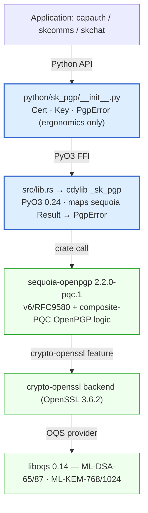
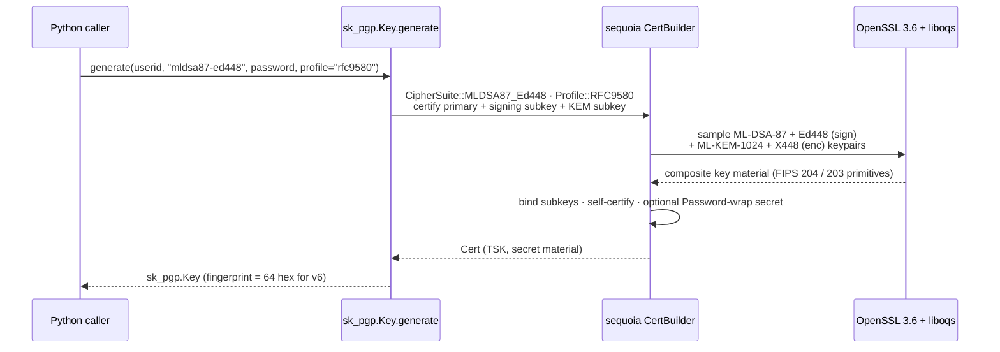
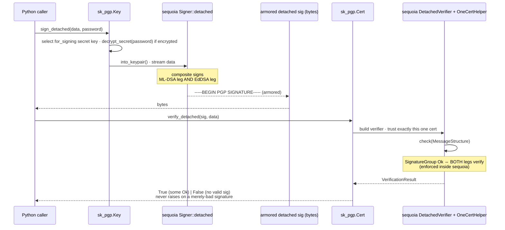

# Architecture — sk_pgp

This document is the **data-flow** view of `sk_pgp`, per the sk-standards
[DATA_FLOW_STANDARD](https://github.com/smilinTux/sk-standards): it traces the
concrete OpenPGP operations **hop by hop**, naming the layer, the operation, and the
**crypto posture** (what protects / proves the bytes) at each step. For the static
trust-stack layering and the self-contained-wheel build flow see
[../SOP.md](../SOP.md) §2–§3; for the per-class API surface see [../README.md](../README.md)
and [../DESIGN.md](../DESIGN.md).

> **Honest-claim banner (carried into every surface):** these are **post-quantum /
> quantum-resistant** algorithms — **never** "quantum-proof," "quantum-safe," or
> "unbreakable." A hybrid composite signature is valid **iff BOTH legs** (lattice
> ML-DSA **and** classical EdDSA) verify; the AND-semantics is enforced **inside
> sequoia**, never in this repo. sk_pgp **binds** sequoia + OpenSSL 3.6 + liboqs 0.14
> and adds **no** original cryptography. Standards: FIPS 203 (ML-KEM), FIPS 204
> (ML-DSA), FIPS 205 (SLH-DSA), RFC 8032 (EdDSA), RFC 9580 (OpenPGP v6),
> draft-ietf-openpgp-pqc (composite PQC).

Everything in sk_pgp funnels through **one Rust extension** (`src/lib.rs`, crate
`_sk_pgp`) and **one engine** (`sequoia-openpgp =2.2.0-pqc.1`). Every Python method is
*wiring* over that engine — there is no cryptographic logic in this repo.

---

## 1. Layering (who protects what)

sk_pgp **owns only the two blue boxes**. The post-quantum assurance is entirely the
green boxes (sequoia / OpenSSL / liboqs), which we pin and bind but never modify.

---

## 2. Keygen data flow (`Key.generate`)

What protects the bytes: the **secret key material** is optionally wrapped with a
caller passphrase (`Password`) before it ever leaves the extension.

**Posture:** v6/RFC 9580 cert; signing leg = ML-DSA-87 **AND** Ed448 composite (NIST
L5); KEM leg = ML-KEM-1024 **AND** X448. Secret material is passphrase-protected at
rest iff `password` is supplied.

---

## 3. Detached-sign → verify data flow (composite AND-semantics)

This is the path `capauth` / `skcomms` / `skchat` use to prove identity. The **crypto
posture at the wire** is an armored detached signature whose validity requires **both**
composite legs.

**Posture / guarantees:**

- The signature is valid **iff both** the ML-DSA leg **and** the Ed448/Ed25519 leg
  verify. sk_pgp never reports a partial composite as valid — the AND is enforced in
  sequoia's composite verification, and `OneCertHelper.check` only returns `Ok` when a
  `SignatureGroup` result is `Ok`.
- `verify_detached` returns a **bool** for a wrong/tampered signature (never raises),
  matching the PGPy call-site contract; it raises `PgpError` only on **malformed**
  signature bytes.
- Verification trusts **exactly one** cert (the verifier's own pubkey) — there is no
  keyring or web-of-trust resolution inside sk_pgp.

---

## 4. Trust boundaries

| Boundary | What crosses it | Protection |
|---|---|---|
| App ⇄ Python | userid, data, passphrase, armored sigs/certs | in-process; passphrase is a `str`, never logged |
| Python ⇄ Rust (`_sk_pgp`) | `&[u8]` / `&str` via PyO3 | same address space; errors normalized to `PgpError` |
| Rust ⇄ sequoia | `Cert`, `KeyPair`, `Password` | sequoia owns all key/sig logic + composite AND-semantics |
| sequoia ⇄ OpenSSL/liboqs | ML-DSA / ML-KEM / EdDSA primitives | FIPS 203/204 + RFC 8032 implementations (vetted deps) |
| Wheel ⇄ host process | bundled `libcrypto-<hash>.so.3` (private SONAME) | self-contained: no collision with the host's `libcrypto.so.3` (see SOP §3) |

---

## 5. What is *not* here (by design)

- **No keyring / WoT / trust resolution** — callers pass the one cert to verify against.
- **No transport** — sk_pgp produces/consumes OpenPGP bytes; moving them is skcomms'
  job. The confidentiality (KEM) counterpart is the
  [`sk-pqc`](https://github.com/smilinTux/sk-pqc-py) family.
- **No original crypto** — every primitive is sequoia + OpenSSL + liboqs.
- **TODO (stubs that raise `PgpError`):** inline sign/verify, ML-KEM `encrypt`/`decrypt`
  message crypto, additive `add_pqc_subkeys`, and DID/JWK public-number extraction. See
  README "Status" table and [../KNOWN_ISSUES.md](../KNOWN_ISSUES.md).
